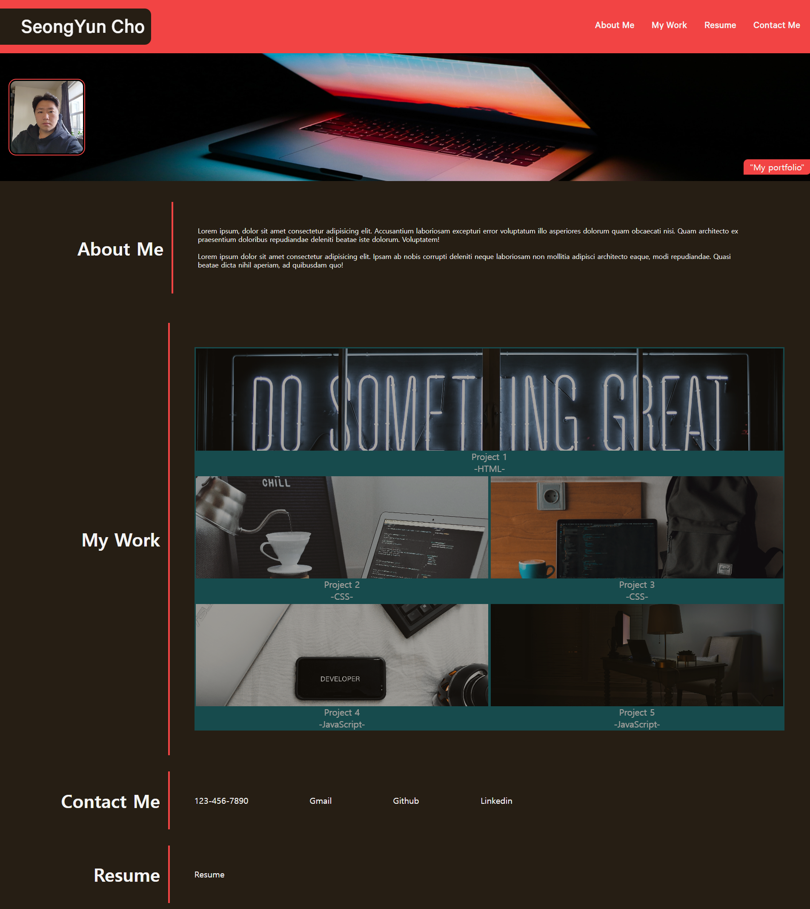

# Personal Portfolio

## Description

Second challenge to make my own personal portfolio with content about myself, work that I have dont, and contact info.
During this challenge I was able to learn more about CSS and HTML, especially on flex elemet. As the class goes on, I hope to update more of my work and improve my portfolio.

## Screenshot

## Tech Used

## Credits
Pictures from
https://unsplash.com/s/photos/portfolio-background

## Link

<a href="https://connorcho66.github.io/portfolio-web/">Like to deployed website</a>

## License

N/A

## Contact

<ul>
    <li><b>Email:</b> <a href="connorcho22@gmail.com">connorcho22@gmail.com</a></li>
    <li><b>Github:</b> <a href="https://github.com/connorcho66">connorcho66</a></li>
</ul>